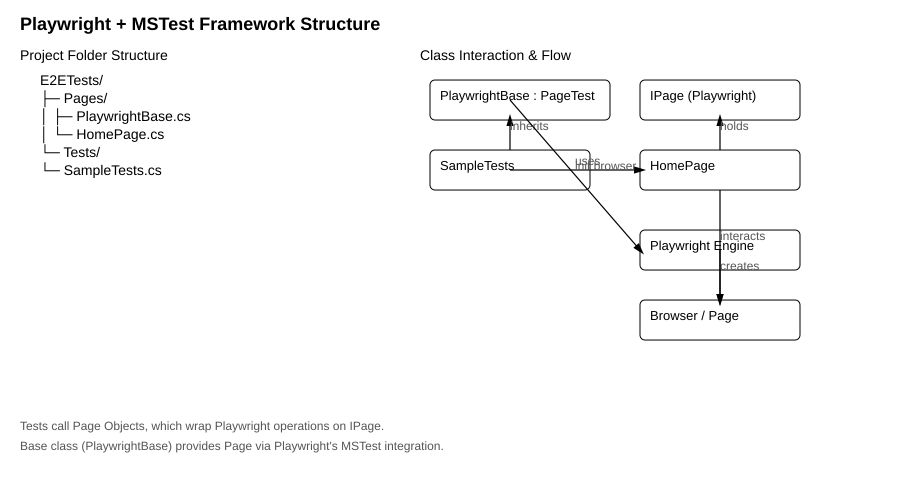

Playwright + MSTest Automation Framework (.NET 10)

This repository contains a clean, scalable UI automation framework using:

Playwright for .NET

MSTest Test Framework

Page Object Model (POM)

.NET 10

Enhanced test.runsettings configuration

The goal is to provide a production-ready foundation for UI automation that is easy to maintain, extend, and share across teams.

1. Getting Started
Prerequisites

Ensure the following are installed:

.NET SDK 10+

Git

Playwright CLI (installed automatically during setup)

2. Clone the Repository
git clone https://github.com/<your-username>/Playwright-CS-MSTest.git
cd Playwright-CS-MSTest

3. Install Dependencies
dotnet restore

4. Install Playwright Browsers
playwright install

5. Run Tests
dotnet test --settings src/tests/E2ETests/test.runsettings

6. Project Structure
src/
└── tests/
    └── E2ETests/
        ├── Pages/
        │   ├── PlaywrightBase.cs
        │   └── HomePage.cs
        ├── Tests/
        │   └── SampleTests.cs
        ├── E2ETests.csproj
        └── test.runsettings

7. Architecture Diagram

Below is an architecture diagram showing how the test framework is structured,
including project layout, class interactions, and how the Playwright engine 
connects to the browser and page objects.

8. Key Concepts
PlaywrightBase.cs

Provides browser/page handling via Playwright's MSTest PageTest.

Page Objects

Encapsulate UI interactions; keep tests clean and maintainable.

SampleTests.cs

Demonstrates how tests interact with page objects.

test.runsettings

Central control for:

Parallel execution

Timeouts

Code coverage

Logging

Environment variables

9. Extending the Framework

Examples of future enhancements:

Adding more Page Objects

Creating reusable utilities

Implementing Test Fixtures

Adding CI/CD workflows

Adding environment configuration (dev/test/stage)

Adding dependency injection

10. Contributing

Contributions are welcome.
Please follow clean coding practices and name conventions aligned with the project structure.

11. License

MIT.